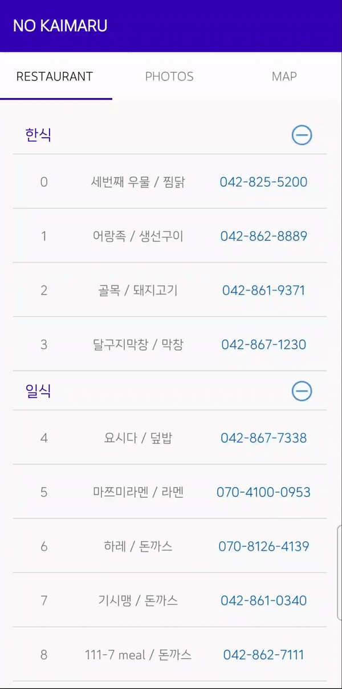

# NO KAIMARU

### 프로젝트 한 줄 소개
> 몰입캠프에 참여한 타대생들을 위하여 학사식당인 카이마루 대신 카이스트 주변 맛집을 소개해준다.

### 팀원 소개
> 김현수, 최종윤  

### 다운로드 링크
> [Click Here](https://drive.google.com/file/d/1U405AnZg8mo9yUkzyT1M2L6q17bdciW0/view?usp=sharing)
---  

### 프로젝트 상세 설명

#### MainActivity

> SplashTheme 를 만든 후 MainActivity의 theme로 설정해 앱 실행 시 로고가 뜬다.
>
> TabLayout을 이용하고, ViewPager의 각 페이지와 연동했다.

#### TAB1 - RESTAURANT

&nbsp;&nbsp;&nbsp;    

+ Design
> 20개 식당의 이름, 연락처를 리스트 형식으로 보여준다. 
> 
> 식당의 카테고리 별로 리스트를 접었다 펼 수 있다. 
> 
> 번호를 클릭하면 번호가 입력된 다이얼로 연결되어 전화를 걸 수 있다. 

+ Implementation
> JSON 파일에 식당의 이름과 연락처를 저장했다.
> 
> ExpandableRecyclerView 를 사용했다.
> 
> 카테고리를 Header로 설정했다. 
> 
> Default 화면은 Header가 전부 펼쳐져 보인다.

#### TAB2 - PHOTOS

&nbsp;&nbsp;&nbsp;    

+ Design
> 각 식당의 사진을 볼 수 있는 갤러리 탭이다. 
> 
> 버튼을 통해 Grid view와 List view를 전환할 수 있다.
>
> 식당의 사진을 클릭할 경우 더 많은 세부 사진을 볼 수 있다.

+ Implementation
> Glide Library를 이용하여 인터넷에서 이미지를 받아온다.
> 
> RecyclerView와 Cardview를 사용했다.
>
> viewHolder를 클릭하면 새로운 ImageSliderctivity로 전환된다.
>
> viewPager2 에서 PhotoView 컴포넌트를 사용하여 사진의 줌 인 / 줌 아웃 기능을 구현했다.

#### TAB3 - MAP

&nbsp;&nbsp;&nbsp;   

+ Design
> 식당의 위치를 지도에서 마커로 확인할 수 있다.
> 
> 마커를 누르면 식당 이름이 뜬다.
> 
> FloatingActionButton을 누르면 GPS를 이용해 현재 위치를 tracking 할 수 있다.

+ Implementation
> 카카오맵 API를 사용했다.
> 
> 위치 권한을 확인하고, GPS가 켜져있는지 확인하여 알림 메세지를 띄운다.
